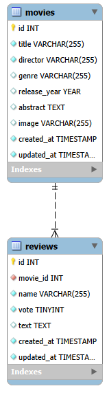

# 🚀 WebApp Express - Movies API

> Backend REST API in Express + MySQL per gestione film e recensioni, con upload immagini e supporto CORS per frontend React.




---

## 🌍 Demo

- API Base URL: locale su `http://localhost:3000`
- Endpoint principale: `http://localhost:3000/api/movies`

---

## 🌟 Caratteristiche principali

- **CRUD base film**: lista, dettaglio, creazione e cancellazione film.
- **Recensioni collegate ai film**: endpoint dedicato per aggiungere recensioni.
- **Upload immagini**: gestione file con Multer e salvataggio in `public/uploads`.
- **MySQL integration**: query SQL dirette su tabelle `movies` e `reviews`.
- **Middleware dedicati**: gestione route inesistenti (`404`) e errori server (`500`).
- **CORS abilitato**: integrazione diretta con frontend React in locale.

---

## 🛠️ Tech Stack

| Tecnologia    | Scopo                         |
| :------------ | :---------------------------- |
| **Node.js**   | Runtime backend               |
| **Express 5** | Routing e middleware API      |
| **MySQL2**    | Connessione e query database  |
| **Multer**    | Upload immagini multipart     |
| **CORS**      | Accesso cross-origin frontend |

---

## 🚀 Quick Start

### Requisiti

Prima di iniziare, assicurati di avere installato:

- Node.js (v18+ consigliato)
- npm
- MySQL Server attivo

### Installazione

```bash
# Entra nella cartella backend
cd "06)WEBAPP/webapp-express"

npm install
```

### Configurazione ambiente

1. Crea il file `.env` partendo da `.env.example`
2. Imposta i valori corretti per DB e porta

```env
PORT=3000
DB_HOST=localhost
DB_USER=your_user
DB_PASSWORD=your_password
DB_NAME=your_database
```

### Database

- Importa il dump SQL da `database/movies_db.sql` nel tuo MySQL.

### Avvio

```bash
# sviluppo con watch
npm run dev

# produzione
npm start
```

Server disponibile su `http://localhost:3000`.

---

## 📡 API Endpoints

| Metodo   | Endpoint                  | Descrizione                             |
| :------- | :------------------------ | :-------------------------------------- |
| `GET`    | `/api/movies`             | Lista di tutti i film                   |
| `GET`    | `/api/movies/:id`         | Dettaglio film + recensioni             |
| `POST`   | `/api/movies`             | Crea nuovo film (multipart con `image`) |
| `DELETE` | `/api/movies/:id`         | Elimina un film                         |
| `POST`   | `/api/movies/:id/reviews` | Inserisce una recensione per il film    |

---

## 📂 Struttura del progetto

```text
.
|-- controllers/
|   |-- movieController.js
|-- database/
|   |-- connection.js
|   |-- movies_db.sql
|-- middleware/
|   |-- fileUpload.js
|   |-- notFound.js
|   |-- serverError.js
|-- public/
|   |-- uploads/
|-- router/
|   |-- movie.js
|-- .env.example
|-- server.js
|-- package.json
|-- README.md
```

---

## 🗺️ Roadmap

- [x] Setup Express + MySQL
- [x] Endpoint index e show film
- [x] Upload immagini film
- [x] Middleware not found e server error
- [x] Gestione recensioni su endpoint dedicato

---

## 🤝 Contribuire

Le contribuzioni migliorano il progetto. Per contribuire:

1. Fai fork del repository
2. Crea un branch: `git checkout -b feature/NomeFeature`
3. Esegui commit: `git commit -m "Add NomeFeature"`
4. Fai push del branch: `git push origin feature/NomeFeature`
5. Apri una Pull Request

---

## 📄 Licenza

Distribuito sotto licenza ISC (vedi `package.json`).

---

## 📧 Contatti

Mirko Bechini - LinkedIn: (https://www.linkedin.com/in/mirko-bechini-892202252) - mirkobechini@gmail.com

Link progetto: https://github.com/mirkobechini/webapp-express
